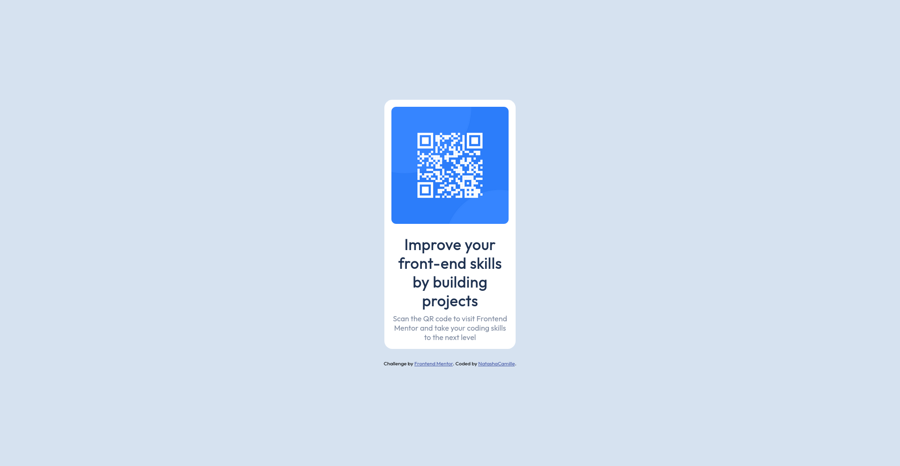

# Frontend Mentor - QR code component solution

This is a solution to the [QR code component challenge on Frontend Mentor](https://www.frontendmentor.io/challenges/qr-code-component-iux_sIO_H). Frontend Mentor challenges help you improve your coding skills by building realistic projects. 

## Table of contents

- [Overview](#overview)
  - [Screenshot](#screenshot)
  - [Links](#links)
- [My process](#my-process)
  - [Built with](#built-with)
  - [What I learned](#what-i-learned)
- [Author](#author)
- [Acknowledgments](#acknowledgments)

### Screenshot

### Links

- Solution URL: [https://github.com/NatashaCamille/qr-code-component]
- Live Site URL: [https://natasha-qr-code-component.netlify.app/]

## My process

### Built with

- Semantic HTML5 markup
- Flexbox

### What I learned

I learned that the fundamentals are always important...
I also enjoyed doing this challenge

### Continued development

Front-end framworks

## Author

- Website - [https://github.com/NatashaCamille]
- Frontend Mentor - [@NatashaCamille]
- Twitter - [@CamilleRoans]

## Acknowledgments

Thanks to my brother that is always encouraging me keep doing my best....